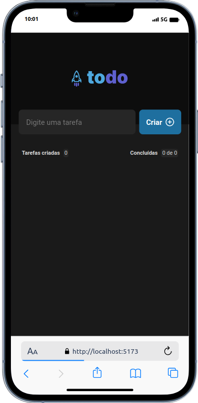
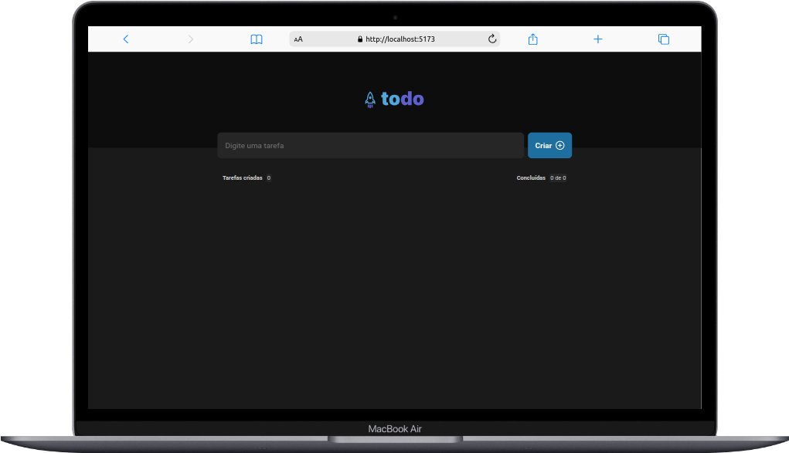

# To Do List

### Design

  
  

### Como rodar o projeto:

- Clone o repositório
- Instale as dependências com `npm install`
- Depois o `npm run dev`
- Para testar o `npx cypress open` ou `npx cypress run`

### Tecnologias utilizadas:

- React
- TypeScript
- Cypress
- Styled-components